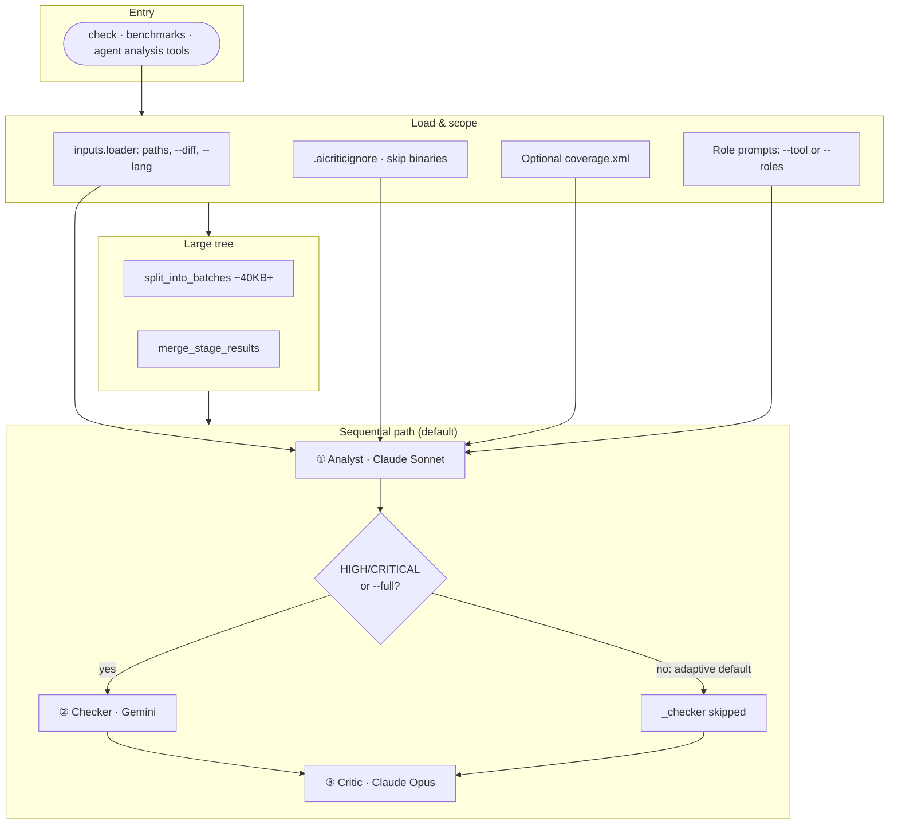
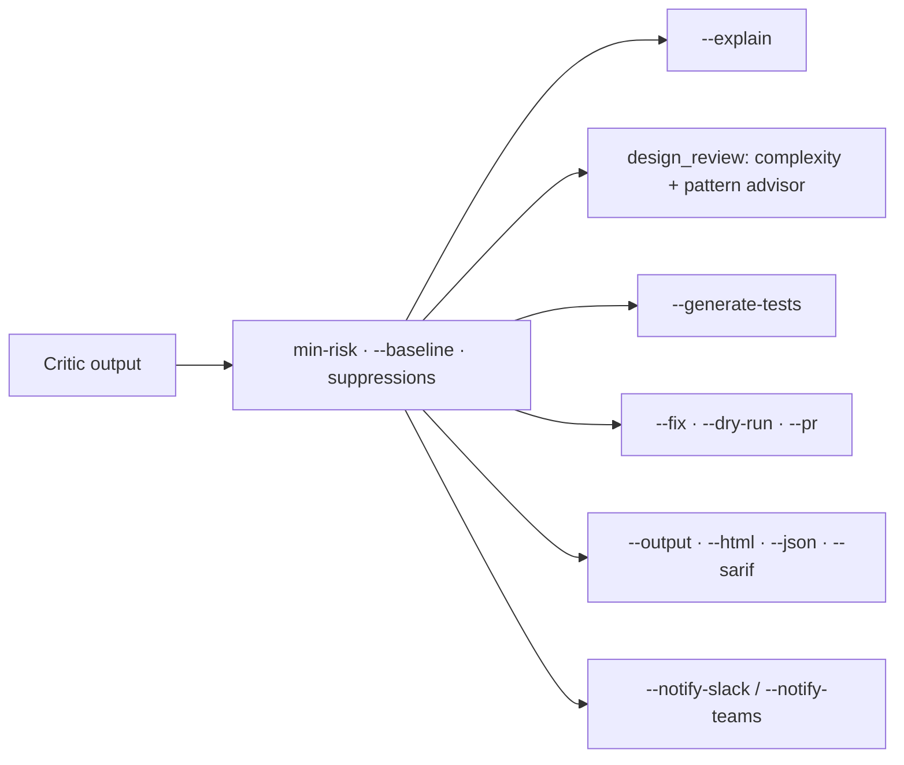
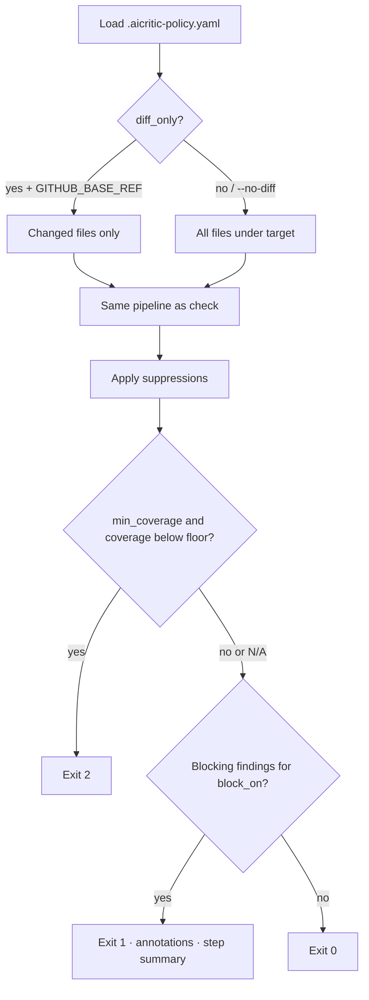
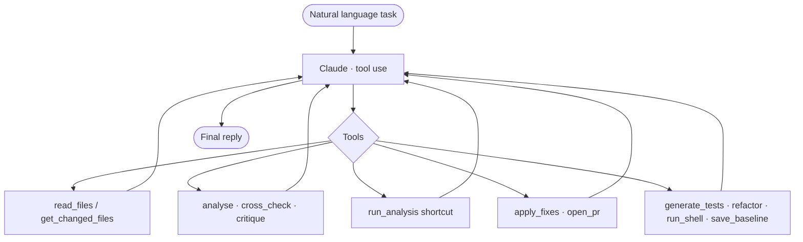

# aicritic — Feature Reference

**This file is the single feature reference** for capabilities, flags, and integrations. Install and quick start: [README.md](README.md); how-tos: [runbooks/](runbooks/). If anything here disagrees with the code, treat **`aicritic.py`**, **`policy.py`**, and **`config.py`** as authoritative.

### Quick map

| Looking for… | Section |
|--------------|---------|
| **Mermaid workflow diagrams** | [Workflow diagrams](#workflow-diagrams-mermaid) |
| Pipeline, `--skip-checker`, `--parallel`, adaptive Gemini, batching | [§1](#1-analysis-pipeline) · cache [§13](#13-pipeline-result-cache) |
| Tool profiles, `--roles`, `code_coverage`, `design_review` | [§2](#2-tool-profiles) · [§16](#16-custom-roles) |
| `--explain` | [§3](#3---explain-mode) |
| `--diff` | [§4](#4-diff-and-incremental-analysis) |
| Baseline / delta | [§5](#5-baseline-and-delta-mode) |
| Suppressions | [§6](#6-inline-suppression) |
| `--fix`, `--pr`, `--generate-tests` | [§7](#7-auto-fix-and-auto-pr) |
| `ci`, `.aicritic-policy.yaml` | [§8](#8-ci-policy-gate) |
| Agent mode | [§9](#9-agent-mode) |
| Copilot extension, org, audit | [§10](#10-copilot-extension) · [§18](#18-org-deployment) · [§19](#19-audit-log) |
| Markdown / HTML / JSON / SARIF | [§11](#11-output-formats) |
| Slack / Teams | [§12](#12-notifications) |
| Languages, `.aicriticignore` | [§14](#14-multi-language-support) |
| Pre-commit | [§15](#15-pre-commit-hooks) |
| `.aicritic.yaml` | [§17](#17-project-config) |

**`.aicritic-patterns.yaml`** — `patterns_config.py` (used with **`design_review`**). Test generation is documented under [§7](#7-auto-fix-and-auto-pr).

| | |
|---|---|
| **Subcommands** | `check` · `ci` · `agent` · `cache-clear` |
| **Shorthand** | `python aicritic.py "…task…" <path>` runs **`agent`** when the first token is not a subcommand |
| **Exit codes** | `0` pass · `1` blocking findings · `2` coverage below policy (`ci` / `check` — see `aicritic.py`) |
| **Adaptive checker** | Gemini skipped if analyst has no HIGH/CRITICAL — **`--full`** always runs it |
| **Run modes** | `--skip-checker` · `--parallel` (if both conflict with skip, skip wins) |

**Built-in `--tool` values:** `secrets_scan` · `error_handling` · `pr_review` · `performance` · `migration_safety` · `test_quality` · `code_coverage` · `dependency_audit` · `dockerfile_review` · `iac_review` · `design_review` — default without `--tool` uses **`security_review`**-style roles under `roles/`.

**Cache env:** `AICRITIC_CACHE_TTL` (`0` disables) · `AICRITIC_CACHE_DIR` — details [§13](#13-pipeline-result-cache).

### Other documentation

| | |
|---|---|
| [README.md](README.md) | Install, quick start |
| [runbooks/cli.md](runbooks/cli.md) | CLI narrative |
| [runbooks/ci-cd.md](runbooks/ci-cd.md) | GitHub Actions, branch protection |
| [runbooks/agent.md](runbooks/agent.md) | Agent mode |
| [runbooks/copilot-extension.md](runbooks/copilot-extension.md) | GitHub App, VS Code |
| [runbooks/org-deployment.md](runbooks/org-deployment.md) | Org-wide deployment |
| [`.github/workflows/aicritic.yml`](.github/workflows/aicritic.yml) | Example workflow |
| [`benchmarks/`](benchmarks/) | Benchmark cases |

---

## Table of contents

1. [Analysis pipeline](#1-analysis-pipeline)
2. [Tool profiles](#2-tool-profiles)
3. [--explain mode](#3---explain-mode)
4. [Diff and incremental analysis](#4-diff-and-incremental-analysis)
5. [Baseline and delta mode](#5-baseline-and-delta-mode)
6. [Inline suppression](#6-inline-suppression)
7. [Auto-fix and auto-PR](#7-auto-fix-and-auto-pr)
8. [CI policy gate](#8-ci-policy-gate)
9. [Agent mode](#9-agent-mode)
10. [Copilot Extension](#10-copilot-extension)
11. [Output formats](#11-output-formats)
12. [Notifications](#12-notifications)
13. [Pipeline result cache](#13-pipeline-result-cache)
14. [Multi-language support](#14-multi-language-support)
15. [Pre-commit hooks](#15-pre-commit-hooks)
16. [Custom roles](#16-custom-roles)
17. [Project config](#17-project-config)
18. [Org deployment](#18-org-deployment)
19. [Audit log](#19-audit-log)

- [Workflow diagrams (Mermaid)](#workflow-diagrams-mermaid)

---

## Workflow diagrams (Mermaid)

GitHub and many Markdown renderers show these as diagrams. The **HTTP Copilot server** always runs Sonnet → Gemini → Opus (no adaptive skip on the checker).

**Static HTML:** open [`index.html`](index.html) in a browser (same diagrams, rendered by [Mermaid](https://mermaid.js.org/) via CDN).

### Core pipeline — `aicritic check`



**Other modes (same critic):** **`--skip-checker`** — Analyst → Critic (no Gemini). **`--parallel`** — Analyst and Gemini run **concurrently** (independent passes), then Critic merges. Batching applies before stage ①.

### After the critic — optional stages and outputs



### CI gate — `aicritic ci`



### Agent mode — tool loop (simplified)



---

## 1. Analysis pipeline

The three-stage chain runs every analysis. Each stage receives the previous
stage's output and either validates or challenges it.

| Stage | Model | Role |
|-------|-------|------|
| Analyst | Claude Sonnet | Reads full source, identifies findings |
| Checker | Gemini 1.5 Pro | Verifies analyst findings, adds any it missed |
| Critic | Claude Opus | Arbitrates disagreements, assigns final risk, writes fix plan |

**Modes:**

**Default (`check` on the CLI)** — If the analyst finds **no HIGH or CRITICAL** findings, the checker (Gemini) stage is **skipped** unless you pass **`--full`** to always run it. The Copilot HTTP server (`server.py`) always runs all three stages.

`--skip-checker` — run Sonnet → Opus only (~20s vs ~90s). Faster; slightly
less thorough. Recommended for large teams running on every commit.

`--parallel` — run Sonnet and Gemini simultaneously (independent analyses,
not sequential). Gemini's findings go directly to Opus for reconciliation.
Slightly faster than sequential; both models work from scratch.

**Auto-batching:** codebases larger than ~40 kB are automatically split into
batches. Results are merged before the critic stage.

**Context-window optimisation:** Opus receives only ±5 lines around each
flagged range — not the full source. This cuts critic input tokens by ~40%
without affecting arbitration quality.

---

## 2. Tool profiles

Select a profile with `--tool <name>`.

| Profile | Focus | Key patterns detected |
|---------|-------|-----------------------|
| `security_review` | General security *(default)* | SQL injection, XSS, command injection, IDOR, insecure deserialization |
| `secrets_scan` | Credential exposure | Hardcoded API keys, tokens, passwords, private keys, connection strings |
| `error_handling` | Reliability | Swallowed exceptions, bare `except`, missing timeouts, silent failures |
| `pr_review` | Change correctness | Regressions, logic errors, missing tests for new code |
| `performance` | Speed/efficiency | N+1 queries, blocking I/O, inefficient data structures, missing caching |
| `migration_safety` | Database ops | Lock contention, long transactions, data loss, failed rollback paths |
| `test_quality` | Test coverage | Always-passing assertions, missing edge cases, happy-path-only tests |
| `code_coverage` | Coverage vs risk | Untested high-risk paths; use with `--coverage` / `coverage.xml` |
| `dependency_audit` | Supply chain | Outdated packages, known CVEs, licence conflicts, transitive bloat |
| `dockerfile_review` | Container security | Root user, exposed secrets, large layers, missing health checks |
| `iac_review` | Infrastructure | Open security groups, missing encryption, overly permissive IAM, hardcoded secrets |
| `design_review` | Design / maintainability | Complexity, anti-patterns, pattern advisor; pairs with `.aicritic-patterns.yaml` |

Each profile provides four role files (analyst, checker, critic, fixer) tuned
for that domain. Use `--roles <dir>` to provide your own.

---

## 3. --explain mode

Adds a teaching card for every finding. Designed for junior developers.

```bash
python aicritic.py check src/ --explain
```

Each card contains:

- **Why this is dangerous** — a concrete attack scenario or failure mode (not
  generic jargon). For SQL injection: what does the attacker type? What data
  is returned?
- **Vulnerable code** — the exact lines from *your* file, copied verbatim.
- **How to fix it** — a corrected version of those exact lines — not a
  generic template.
- **Remember** — one sentence to carry forward as a rule of thumb.

**In Copilot Chat (`@aicritic`):** the explainer runs automatically after every
analysis. Junior developers get explanations without needing to know the flag exists.

**In reports:** explanation cards are embedded in `--output` (Markdown),
`--html`, and `--json` reports.

---

## 4. Diff and incremental analysis

Analyse only files changed since a git reference.

```bash
python aicritic.py check src/ --diff main
python aicritic.py check src/ --diff HEAD~1
python aicritic.py check src/ --diff origin/main
```

**How it works:** calls `git diff --name-only <ref>...HEAD` and loads only
the listed files. Unchanged files are skipped entirely.

**Pipeline cache** (see §13) makes repeated runs on unchanged code near-instant.
On a re-run with no file changes, all three stages are returned from disk cache
and the total wall-clock time drops to under a second.

---

## 5. Baseline and delta mode

Track known issues and surface only new ones.

```bash
# Save current findings as baseline
python aicritic.py check src/ --save-baseline .aicritic_baseline.json

# Later: only show NEW findings not in the baseline
python aicritic.py check src/ --baseline .aicritic_baseline.json
```

**Fingerprinting:** each finding is SHA1-hashed on `(file, line_range,
description[:80])`. A finding matches a baseline entry only if all three match.
Moving code to a different file or significantly changing a description creates
a new fingerprint.

---

## 6. Inline suppression

Formally dismiss a finding without modifying the shared baseline file.

**Syntax (same-line):**
```python
result = db.execute(raw_sql)  # aicritic: accepted-risk ORM validates all inputs
```

**Syntax (prev-line):**
```python
# aicritic: accepted-risk internal endpoint — no external user input reaches here
result = db.execute(raw_sql)
```

**Supported languages:**

| Language | Comment style |
|----------|---------------|
| Python, Shell, Ruby, YAML | `# aicritic: accepted-risk <reason>` |
| JS, TS, Go, Java, C, Rust | `// aicritic: accepted-risk <reason>` |
| CSS, SQL block | `/* aicritic: accepted-risk <reason> */` |
| SQL line | `-- aicritic: accepted-risk <reason>` |
| INI / config | `; aicritic: accepted-risk <reason>` |

**What happens to suppressed findings:**
- Removed from console output and all reports' findings sections.
- Appear in a **Suppressed Findings** table (risk, file, line, reason) so leads
  can audit what has been accepted.
- Not counted by the CI policy gate — will not block a PR.
- The models still *detect* the issue (it appears in analyst/checker output);
  suppression is a reporting concern, not a detection bypass.

---

## 7. Auto-fix and auto-PR

Apply critic recommendations directly to source files.

```bash
# Fix and show diff without writing files
python aicritic.py check src/ --fix --dry-run

# Fix and write changes
python aicritic.py check src/ --fix

# Fix, commit, push, and open a GitHub PR
python aicritic.py check src/ --fix --pr

# Only fix HIGH and above
python aicritic.py check src/ --fix --min-risk high
```

**Two-phase fixer:**

1. **Literal patches** — when the critic provides a `find`/`replace` pair with
   `confidence: high`, the patch is applied deterministically (no LLM call).
   The `find` string must appear exactly once in the file.

2. **LLM rewrite** — for ambiguous or multi-location recommendations that can't
   be expressed as a literal patch, Claude Sonnet rewrites the full file content.

**PR creation:** creates branch `aicritic/fix-<tool>-<timestamp>`, commits fixed
files, pushes, and calls `POST /repos/{owner}/{repo}/pulls`. After the PR is
opened, posts an inline GitHub review with one comment per finding pinned to the
exact line.

### Test generation (`--generate-tests`)

After analysis, optionally generate runnable tests aimed at **high-risk, under-covered** code. Detects the test framework from the repo; tracks coverage in `.aicritic-coverage-history.json`. Set **`min_coverage`** in `.aicritic-policy.yaml` to enforce a floor — `check` or `ci` can exit **2** if coverage is below that threshold. **`--auto-commit-tests`** must be set explicitly before generated tests are allowed to be committed. See `pipeline/test_generator.py`.

---

## 8. CI policy gate

Block PR merges on policy-defined risk levels.

**Policy file** (`.aicritic-policy.yaml` at repo root):

```yaml
block_on: [critical, high]   # risk levels that fail the gate
tool: security_review        # analysis profile
min_risk: low                # minimum risk to include in the report
diff_only: true              # analyse changed files only (recommended)
skip_checker: false          # skip Gemini for speed
# min_coverage: 70           # optional: CI exits 2 if line coverage is below this %
```

**GitHub Actions workflow** (`.github/workflows/aicritic.yml`):
```yaml
- name: Run aicritic CI gate
  env:
    GITHUB_TOKEN: ${{ secrets.GITHUB_TOKEN }}
  run: python aicritic.py ci .
```

**What the gate does:**
1. Loads `.aicritic-policy.yaml` (uses defaults if absent: `block_on: [critical, high]`).
2. Runs the pipeline on changed files (`GITHUB_BASE_REF` auto-detected in Actions).
3. Applies inline suppression comments.
4. Emits `::error` / `::warning` annotations — these appear as inline PR diff
   annotations in the GitHub UI without any additional tooling.
5. Writes a Markdown step summary to `$GITHUB_STEP_SUMMARY`:
   - ❌ Blocking findings table
   - ℹ️ Below-threshold findings
   - 🔕 Suppressed findings with accepted-risk reasons
6. Exits **0** (passed), **1** (blocking findings), or **2** (coverage below `min_coverage` when that policy is set — see `aicritic.py`).

**Exit codes:**

| Code | Meaning |
|------|---------|
| 0 | No blocking findings — PR can merge |
| 1 | One or more blocking findings — PR is blocked |
| 2 | Coverage floor failed (`min_coverage` in policy), or same from `check` when test-generation policy applies |

**Coverage gate:** `min_coverage` is only evaluated when overall line coverage can be computed from the loaded **`inputs`** (typically `python aicritic.py check … --coverage coverage.xml`). The stock **`aicritic ci`** invocation does not load a coverage file unless you extend your workflow to pass one into a custom step or merge coverage the same way `check` does.

**Running locally** (same logic, no GitHub-specific output):
```bash
python aicritic.py ci src/
python aicritic.py ci src/ --no-diff   # analyse all files, not just changed
```

---

## 9. Agent mode

Describe a task in plain English. Claude Opus drives the pipeline via tool-use.

```bash
python aicritic.py agent "review my PR for security issues and fix the high-risk ones" src/
python aicritic.py agent "scan for hardcoded secrets" .
python aicritic.py agent "check what changed since main and open a PR with fixes" src/ --tool pr_review
```

**Available tools (Claude can call these):**

| Tool | What it does |
|------|-------------|
| `get_changed_files` | Load files changed vs a git ref into the session |
| `read_files` | Load source files from the target into the session |
| `read_file` | Read a single file |
| `write_file` | Write a file (small targeted edits) |
| `run_analysis` | Run the full three-model chain in one call |
| `analyse` | Analyst (Sonnet) only |
| `cross_check` | Checker (Gemini) — use after `analyse` when needed |
| `critique` | Critic (Opus) — final verdict after `analyse` (and usually after `cross_check` if used) |
| `apply_fixes` | Apply critic recommendations |
| `open_pr` | Create branch, push, open GitHub PR with inline review comments |
| `run_shell` | Run a linter or test command (sandboxed to target) |
| `refactor` | Design pattern advisor (complexity, anti-patterns) |
| `generate_tests` | Generate tests for high-risk gaps; optional `output_file` |
| `save_baseline` | Persist findings as baseline |

**Flags:**

```bash
--tool NAME       default analysis profile
--min-risk LEVEL  default threshold (low/medium/high)
--max-steps N     safety ceiling on iterations (default 12)
--roles DIR       custom roles directory
```

**In Copilot Chat:** prefix your message with `@agent`:
```
@aicritic @agent review my PR and fix high-risk issues
```

---

## 10. Copilot Extension

Use `@aicritic` directly inside VS Code Copilot Chat — no terminal needed.

**Setup:**
1. Run the server: `uvicorn server:app --reload --port 8000`
2. Expose via ngrok: `ngrok http 8000`
3. Register a GitHub App pointing to the ngrok URL
4. Install the App on your repo/org
5. In VS Code: open Copilot Chat → type `@aicritic`

**Usage:**
```
@aicritic check this code for security issues
@aicritic scan for hardcoded secrets
@aicritic review my error handling
@aicritic @agent review my PR and fix high-risk issues
```

**What it returns:** same three-stage analysis streamed as markdown, including
the explainer section (WHY + fix) for every finding — automatically, without
needing `--explain`.

**Authentication:** each request carries the user's Copilot bearer token. Model
calls are billed to the org's Copilot Enterprise licence, not a shared key.

**Security:** ECDSA-P256 signature verification on every request. Set
`AICRITIC_DEV_MODE=true` to skip during local development.

---

## 11. Output formats

| Format | Flag | Contents |
|--------|------|----------|
| Markdown | `--output FILE` | Findings tables, recommendations, suppressed findings, explanation cards |
| HTML | `--html FILE` | Self-contained, inline CSS, risk badges, explanation cards with colour-coded code blocks |
| JSON | `--json FILE` | Full structured output: analyst, checker, critic, explanations, suppressed list |
| SARIF 2.1.0 | `--sarif FILE` | GitHub code-scanning native format; risk → severity mapping |

**SARIF severity mapping:**
- `critical` / `high` → `error`
- `medium` → `warning`
- `low` → `note`

Upload to GitHub code scanning:
```yaml
- uses: github/codeql-action/upload-sarif@v3
  with:
    sarif_file: scan.sarif
```

---

## 12. Notifications

Post a summary to Slack or Microsoft Teams after every run.

```bash
python aicritic.py check src/ \
  --notify-slack  https://hooks.slack.com/services/... \
  --notify-teams  https://outlook.office.com/webhook/...
```

Or set in `.aicritic.yaml`:
```yaml
notify_slack: https://hooks.slack.com/services/...
notify_teams: https://outlook.office.com/webhook/...
```

Payload includes: verdict, finding count, high/critical count, top findings, and
a link to the full report. No external SDK dependency (uses `urllib.request`).

---

## 13. Pipeline result cache

Repeated runs on unchanged code are near-instant.

**How it works:** before each API call, a SHA1 is computed over
`(stage, model, system_prompt, file_contents)`. If the hash matches a cached
result (stored in `.aicritic_cache/`) that is less than 24 hours old, the API
call is skipped entirely.

**Effect:** a 50-file codebase that hasn't changed since the last run completes
all three stages in under a second instead of ~90 seconds.

**Configuration:**
```bash
AICRITIC_CACHE_TTL=86400    # TTL in seconds (default 24h)
AICRITIC_CACHE_TTL=0        # disable caching (recommended for CI)
AICRITIC_CACHE_DIR=.cache/aicritic   # override cache location
```

**Clear the cache:**
```bash
python aicritic.py cache-clear
```

The cache directory is gitignored by default.

---

## 14. Multi-language support

16 languages detected automatically by file extension.

| Language | Extensions |
|----------|------------|
| Python | `.py` |
| JavaScript | `.js`, `.mjs`, `.cjs` |
| TypeScript | `.ts`, `.tsx` |
| Go | `.go` |
| Java | `.java` |
| Ruby | `.rb` |
| Rust | `.rs` |
| C# | `.cs` |
| PHP | `.php` |
| Kotlin | `.kt`, `.kts` |
| Swift | `.swift` |
| Shell | `.sh`, `.bash`, `.zsh` |
| Dockerfile | `Dockerfile`, `.dockerfile` |
| Terraform | `.tf`, `.tfvars` |
| YAML | `.yaml`, `.yml` |
| SQL | `.sql` |

```bash
# Filter to specific languages
python aicritic.py check . --lang python --lang typescript
```

**`.aicriticignore`** — gitignore-style glob patterns to exclude files:
```
# .aicriticignore
tests/fixtures/
**/*.generated.py
vendor/
```

---

## 15. Pre-commit hooks

Two hooks available via `.pre-commit-hooks.yaml`.

```yaml
# .pre-commit-config.yaml
repos:
  - repo: https://github.com/anirudhyadav/ai-critic
    rev: main
    hooks:
      - id: aicritic-secrets    # runs on every commit — fast secrets scan
      - id: aicritic-security   # runs on push — full security review
```

| Hook | Trigger | Tool | Blocking |
|------|---------|------|---------|
| `aicritic-secrets` | pre-commit | `secrets_scan` | HIGH only |
| `aicritic-security` | pre-push | `security_review` | HIGH only |

---

## 16. Custom roles

Override any pipeline stage with a custom role file.

```bash
python aicritic.py check src/ --roles ./my-roles/
```

Each role file is a Markdown file with YAML frontmatter:

```markdown
---
mode: security
focus: OWASP Top 10
strictness: high
min_risk: medium
model: claude-opus-4-5
---

Focus exclusively on OWASP Top 10 vulnerabilities.
Pay special attention to injection attacks and broken authentication.
Flag any use of MD5 or SHA1 for password hashing as CRITICAL.
```

**Frontmatter fields:**

| Field | Values | Effect |
|-------|--------|--------|
| `mode` | `security`, `pr_review`, etc. | Selects base system prompt |
| `strictness` | `low`, `medium`, `high` | Adjusts model sensitivity |
| `min_risk` | `low`, `medium`, `high` | Default risk filter for this role |
| `model` | any model ID | Overrides the default model for this stage |
| *(body)* | Markdown | Appended to the system prompt as role instructions |

Provide four files: `analyst.md`, `checker.md`, `critic.md`, `fixer.md`.

---

## 17. Project config

Set per-repo defaults in `.aicritic.yaml` — CLI flags always take precedence.

```yaml
# .aicritic.yaml
tool: secrets_scan
min_risk: medium
skip_checker: false
parallel: false
languages:
  - python
  - typescript
baseline: .aicritic_baseline.json
sarif: aicritic.sarif
output: reports/aicritic_report.md
notify_slack: https://hooks.slack.com/services/...
notify_teams: https://outlook.office.com/webhook/...
diff: main
roles: ./custom-roles/
```

aicritic walks up from the target directory to find the file (same behaviour
as `.gitignore`). Useful for monorepos with different standards per package.

---

## 18. Org deployment

Deploy aicritic as a GitHub Copilot Extension that all org members can use
from VS Code Copilot Chat, billed to the org's existing Copilot Enterprise licence.

**Key properties:**
- Each employee's request uses their personal Copilot bearer token for model calls.
- No shared service-account token is exposed to developers.
- Access gated by org membership (`AICRITIC_ORG=my-org`).
- All requests logged to the audit file.

**Environment variables:**

| Variable | Required | Description |
|----------|----------|-------------|
| `GITHUB_TOKEN` | Yes | PAT for CLI fallback and PR operations |
| `AICRITIC_DEV_MODE` | Dev only | `true` skips signature + org verification |
| `AICRITIC_ORG` | Recommended | GitHub org slug — restricts to members only |
| `AICRITIC_AUDIT_LOG` | Optional | Path for JSONL audit file |
| `AICRITIC_CACHE_TTL` | Optional | Cache TTL in seconds (default 86400) |
| `AICRITIC_CACHE_DIR` | Optional | Override cache directory |

See [runbooks/org-deployment.md](runbooks/org-deployment.md) for full setup.

---

## 19. Audit log

Every request (allowed or denied) is logged as a JSON line.

**Allowed request:**
```json
{"ts":"2025-04-17T12:34:56Z","user":"alice","tool":"security_review","files":3,"findings":5,"high_count":2,"agent_mode":false,"duration_ms":4200,"verdict":"HIGH — 2 issues found"}
```

**Denied request:**
```json
{"ts":"2025-04-17T12:34:00Z","user":"unknown","denied":true,"reason":"not_org_member"}
```

**Configuration:**
```bash
AICRITIC_AUDIT_LOG=./logs/audit.jsonl
```

Always written to the Python logger at `INFO` level regardless of the file setting.
Compatible with any log aggregator (Datadog, Splunk, CloudWatch, `grep`).
